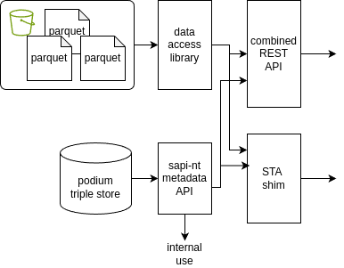

# Combined API sketch

## Outline

After various investigations of API options we propose that FDRI adopt a dual approach to a combined API.

1. A simple REST API in the style of the existing metadata API and data APIs, with a unified set of query routes, and the ability combine data and metadata queries (use metadata query results to define the data sets to access).

2. A SensorThing API (STA) shim based on the STA [model mapping](../../ontology/doc/ogc-sensor-things.md) and [profiling](./api-profiling.md) already sketched.

Each implementation would act as a broker for the metadata API. In the case of the simple REST API it would largely just proxy a subset of the metadata API calls. Whereas the STA implementation would act as a shim, translating STA calls (within the supported profile) to metadata API calls and mapping the returned json format back to STA format. 

For data accesses some common tooling for querying the parquet blob store may be possible but we see the combined REST API as a reimplementation of the existing data API rather than a wrapper over it.



## REST API unified query routes

For discussion.

Suggest basing the URI routing patterns on the metadata API layout which are (roughly) based on original [UK Gov URI Sets recommendations](https://www.gov.uk/government/publications/designing-uri-sets-for-the-uk-public-sector). 

* `/id/...`  for entities and sets of entities
* `/ref/...` for reference data
* `/data/...` for data streams

With use of standard REST style path patterns to traverse sets, for example:

```
/id/dataset/{id}/data?{filters}
```

to get data for a specific dataset as alias for:

```
/data?dataset={id}&{filters}
```

The latter would allow data from multiple datasets to be fetched at once:

```
/data?dataset={id1}&dataset={id2}&{filters}
```

Simplifying to focus on list endpoints and key filters. Including filters (text and geo search not yet enabled on the metadata API but supported by the tech stack).

| What | REST endpoint | REST Filters | Approximate STA endpoint |
|---|---|---|---|
| Monitoring programmes | `/id/programme` | | - |
| Monitoring networks | `/id/network` | `contains={site-uri]`| - |
| Monitoring sites | `/id/site` | `search={text}` `lat=&lon=&dist` `within={polygon}` | `/Things` |
| Monitoring platforms | `/id/platform` | `isPartOf={site\|platform}` `observes={op}` | - |
| Sensors | `/id/sensor` | | `/Sensors` though "virtual" sensors |
| Deployments | `/id/site/{id}/_deployments` `/id/site/{id}/_currentDeployments` `/id/platform/{platform}/_deployments` `/id/platform/{platform}/_currentDeployments` | `startedAtTime={t}` `endedAtTime={t}` | - |
| Datasets | `/id/dataset` | `processingLevel=` `observedProperty={op}` `originatingSite={site}` `measure.aggregation.resolution={d}` `measure.aggregation.valueStatistic` `type={tsd}` | `/Datastreams` |
| Time series definition (includes methodology) | `/ref/time-series-definition` | `observedProperty={op}` `measure.aggregation.resolution={d}` `measure.aggregation.valueStatistic` | - |
| Time series data for a dataset | `/id/dataset/{id}/observation` | `start_date` `end_date` `aggregate` | `/Datastreams/Observations` |
| Individual observation for a dataset (e.g. image) | `/id/dataset/{id}/observation/{id}` | | `/Datastreams/Observations` |
| Time series data across datasets | `/data/timeseries` | `dataset={id}` `observedProperty={op}` `originatingSite={site}` `measure.aggregation.resolution={d}` `measure.aggregation.valueStatistic`  `start_date` `end_date` `aggregate` | `/Observations(id)` |
| Reference concept schemes| `/ref/scheme` | | - |
| Concepts in reference scheme | `/ref/{group}/{scheme}/_concepts` etc | | - |

## Open questions

1. How does the notion of "collections" in the current data API match up the time series and TSDs in the metadata store?

2. How much of the callibration and processing configuration to expose? Does that require custom endpoints different from the internal-use API endpoints?

3. Can we unify the filtering patterns for data streams and metadata lists, particular min/max/min-eq/max-eq patterns for time stamps?

4. How to handle other datatypes such as phenocam images? Above patterns suggest treating these as a time series with observations comprising minimal metadata with onward links to actual image files. Does that work?
