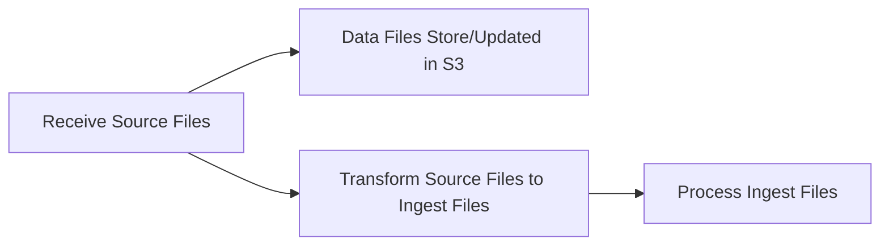

# Notes on Second Gauging Data Example Set (Observatory Format - Epimorphics - 09-01-26)

**Author: Kal Ahmed (Epimorphics)**
**Date: 13/01/2026**

## Introduction

As there are many different data sources each with its own features, I have attempted to summarise what information is provided in each in the sections below.

Following that, I propose an approach to ingesting metadata from these different sources that is based on adding a pre-processing step that converts from project-specific format to an FDRI-defined "ingestable" format that focuses on the metadata for sites, surveys, survey data and site flow data.

Finally I propose next steps for moving forward with implementing this approach.

## EA manual guaging

### Site flow data.
  * Colums are:
    * DateTime (YYYY-MM-DD HH:mm:ss)
    * Q

### Survey Metadata

There is no survey metadata

### Survey Data

There is no survey data

## Nivu Flowstick

### Site Flow Data

Columns are:

  * DateTime (DD.MM.YYYY HH:mms:ss)
  * Q
  * Type

**NOTE**
Type appears to be instrument type, example has the same value for every cell. Ignore?

### Survey Metadata

Columns are:

  * SiteID
  * SiteName
  * Date (DD.MM.YYYY)
  * Time (HH:mm:ss)
  * DateTime (DD.MM.YYYY HH:mm:ss) - shows a different time value from the Time column
  * Q (decimal)
  * Width (decimal)
  * Area (decimal)
  * MeanDepth (decimal)
  * MinDepth (decimal)
  * MaxDepth (decimal)
  * MeanVelocity (decimal)
  * MinVelocity (decimal)
  * MaxVelocity (decimal)
  * P (decimal)
  * NumberOfPoints (decimal)
  * NumberOfSections (decimal)
  * SystemType (string) - appears to be the model of flowstick used?

**NOTES**

The example file has multiple rows, possibly indicating two sub-activities as part of the survey with different timestamps. This may explain the difference between the time recorded in the `Time` column and the `DateTime` column.

All of the result values for the two rows are exactly the same - not sure if that is a data issue or there really was that much consistency in readings on the day.

##  OTT MFPro

### Site Flow Data

Columns are:

  * DateTime (YYYY-MM-DD HH:mm:ss)
  * Q (decimal)
  * Type - always OTT MFPro

### Survey Metadata

Columns are:

  * SiteID
  * SiteName
  * Date (DD.MM.YYYY, with a leading space)
  * Time (HH:mm:ss)
  * Party (string)
  * Q (decimal with trailing space)
  * Area (decimal with unit) - units are not consistent across rows
  * MeanDepth (decimal with unit) - units are not consistent across rows
  * NumberOfStations (integer)
  * StageReference (decimal with unit) - units are not consistent across rows
  * SensorType (string) - indicates a capability (*Velocity only*)
  * SensorModel (string)
  * DateTime (YYYY-MM-DD HH:mm:ss) - matches the `Date` and `Time` columns.

**NOTES**
  
There appears to be two surveys on the same day, each with one resulting Q value in the site time-series, and they have been combined into a single file.

### Survey Data

Columns are:

  * SiteID
  * SiteName
  * Date (DD.MM.YYYY)
  * Time (HH:mm:ss)
  * StationNumber (integer/id?)
  * Location (decimal, optional)
  * Depth (decimal)
  * Method (string/id?)
  * FlowSpeedSurface (decimal)
  * 0.2 (m/s) (decimal)
  * 0.4 (m/s) (decimal)
  * 0.6 (m/s) (decimal)
  * 0.8 (m/s) (decimal)
  * FlowSpeedBed (decimal)
  * MeanVelocity (decimal)
  * Area (decimal)
  * Q (decimal, optional)

**NOTES**
  
There is no indication of which of the two entries in the site time series each of the rows in this data file contributed to. (e.g. no `DateTime` column that would link the rows in this dataset to the site timeseries dataset)

## RCA

### Site Flow Data

Columns are:

  * Date (YYYY-MM-DD) - no time
  * Q (decimal)
  * Type

### Survey Metadata

There is no survey metadata for this dataset

### Survey Data

Columns are:

  * SiteID
  * SiteName
  * Date (YYYY-MM-DD)
  * Q (decimal)
  * Vertical (String)
  * track (decimal)
  * width (decimal)
  * depth (decimal)
  * mean_depth (decimal)
  * area (decimal)
  * Revolutions (decimal)
  * exposure_time (decimal)
  * rps (decimal)
  * velocity (decimal)
  * mean_velocity (decimal)

## Sontek ADCP

### Site Flow Data

Columns are:

  * DateTime (YYYY-MM-DD HH:mm:ss)
  * Q (decimal)
  * Type (sensor type)

### Survey Metadata

There is no survey metadata

### Survey Data

There are two levels of survey data for this dataset.

Summary Data has columns:

* SiteID
* SiteName
* Date (YYYY-MM-DD)
* DateTime (YYYY-MM-DD HH:mm:ss)
* TransectID (integer/id?)
* Duration (HH:mm:ss)
* Track (decimal)
* Width (decimal)
* Area (decimal)
* BoatSpeed (decimal)
* MeanFlowSpeed (decimal)
* LeftQ (decimal)
* RightQ (decimal)
* TopQ (decimal)
* MiddleQ (decimal)
* BottomQ (decimal)
* Q (decimal)
* PercentageMeasured (decimal)

Ensemble Data has columns:

* SiteID
* SiteName
* Date (YYYY-MM-DD)
* DateTime (DD/MM/YYYY HH:mm:ss)
* TransectID (integer/id)
* EnsembleNumber (integer)
* Profile (string/id)
* Depth (decimal)
* Track (decimal)
* MeanFlowSpeed (decimal)
* BoatSpeed (decimal)

Summary data is derived from ensemble data. Site flow data is derived from summary data (?)

## Metadata service ingestion proposal

Assumptions

1) There should be a metadata record for
   * each Site Flow data file,
   * each Survey data file (both ensemble and summary in the case of Sontek)
   * each Survey

2) There should be a standard format for:
  * Site Metadata
  * Site Flow Dataset Metadata
  * Survey Metadata
  * Survey Dataset Metadata
  
Site Metadata should include:

Italics indicate properties that are not evidenced in the provided examples but which are in use elsewhere

  * Site Identifier (REQUIRED)
  * Site Name (REQUIRED)
  * Site location (lat/long) (REQUIRED)
  * *Site Operator Identifier (OPTIONAL)*
  * *Site installation date (OPTIONAL)*
  * Additional site annotations (OPTIONAL)
  * Observed Properties (REQUIRED) - in this case would always be Q so maybe could be omitted and simply encoded in the ingester
  
Survey Metadata should include

  * Site Identifier (REQUIRED)
  * Survey Identifier (may be derived from date/time) (REQUIRED)
  * Survey Date/Time (REQUIRED)
  * Responsible party (OPTIONAL)
  * Sensor Type (OPTIONAL)
  * Sensor Model (OPTIONAL)

Survey Dataset Metadata should include

  * Site Identifier (REQUIRED)
  * Survey Identifier (REQUIRED)
  * Dataset Identifier (may be derived from site and survey identifier) (REQUIRED)
  * Derived Dataset Identifier (OPTIONAL)
  * Survey Date/Time (REQUIRED)
  * Observed Properties (REQUIRED)
  * Dataset location (in S3) (REQUIRED)

Site Flow Dataset Metadata should include

  * Site Identifier
  * Earliest observation date/time
  * Latest observation date/time
  * Dataset location (in S3)
  
Annotations may be added to any of these metadata blobs.

Site Metadata Annotations should include

  * Site Identifier
  * Annotation Property
  * Annotation Value

Survey Metadata Annotations should include

  * Site Identifier
  * Survey Identifier
  * Annotation Property
  * Annotation Value

Survey Dataset Annotations should include:

  * Site Identifier
  * Survey Identifier
  * Annotation Property
  * Annotation Value

Rather than having a separate mapping for every variation of input file, it makes sense for the ingester to define an accepted profile for each of these and for the FDRI team to transform the source data (CSV or Parquet) to the ingest format. This would make the data flow:

Adding the transformation step makes it possible for new sources of flow data to be incrementally onboarded by defining the transformation mapping only without the need to create a more complex metadata ingest mapping. As the ingest files would have a defined format (either JSON defined in a JSON schema or CSV with a defined column set) it would be possible to validate the transformation prior to ingestion to ensure that minimum metadata requirements are met.

## Proposed Next Steps

All of the following can be done by Epimorphics:

* Define ingest file formats as either a JSON schema or as a CSV specification (possibly CSVW?)
* Define ingest templates to map from ingest file format into the metadata store
* Manually generate ingest files for the samples that were provided
* Ingest the sample metadata files

We can then review the outputs and decide if the level of metadata provided is sufficient. Once we have achieved this, additional steps for the FDRI team are to:

* Define where the downloadable data for these datasets are to be stored and the path and file naming convention for the files.
* Upload source files according to the chosen file naming conventions
* Create scripts to convert source files
* Batch convert all available source files into ingest files
* Ingest the batch converted files